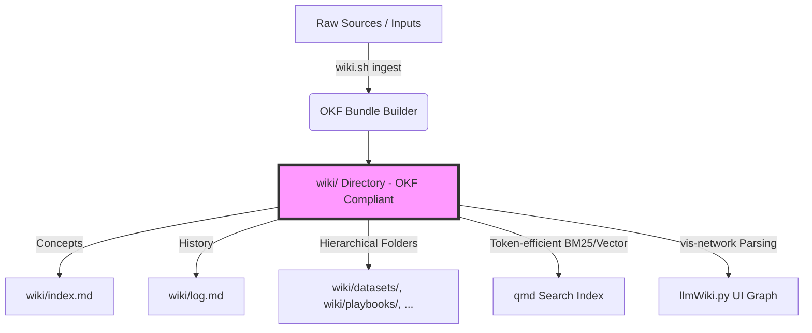

# Implementierungsplan: Open Knowledge Format (OKF) für LLMWikiNG

Dieses Dokument beschreibt die vollständige Analyse des aktuellen Repositories und liefert einen detaillierten, szenariobasierten Implementierungsplan zur Migration von **LLMWikiNG** zum standardisierten **Open Knowledge Format (OKF) v0.1**.

---

## 1. IST-Analyse (LLMWikiNG Repository)

Das aktuelle Repository `LLMWikiNG` implementiert das **LLM-Wiki-Pattern** (nach Karpathy) mit einer flachen Dateistruktur, Obsidian-artigen Links und einem rudimentären Änderungslog.

### 1.1 Ordnerstruktur
*   **`wiki/`**: Flaches Verzeichnis für alle Markdown-Dateien. Enthält außerdem Systemdateien wie `index.md`, `log.md` und `ingestlater.md`.
*   **`raw/`**: Unveränderte Quelldateien.
*   **`output_docs/`**: Exportierte Dokumente.

### 1.2 Syntax und Metadaten (Frontmatter)
Die aktuellen Wiki-Seiten nutzen folgendes Frontmatter-Format:
```yaml
---
title: "Titel der Seite"
source: "dateiname.md"
created: YYYY-MM-DD
tags: []
---
```
*   **Defizite zu OKF:** Es fehlt das obligatorische Feld `type` (z.B. `Concept`, `Article`, `Reference`, `Playbook`). Das Feld `created` entspricht nicht dem OKF-Standard `timestamp` (ISO 8601). Es gibt keine vordefinierte Struktur für externe Ressourcen-Links (`resource`).

### 1.3 Querverweise (Linking)
*   **Aktuell:** Obsidian-Style-Wiki-Links (`[[dateiname.md]]` oder `[[Unterordner/dateiname.md]]`).
*   **Defizite zu OKF:** OKF verlangt standardmäßige Markdown-Links, entweder absolut bezogen auf das Bundle-Root (`/pfad/zur/datei.md`) oder relativ (`./datei.md`).

### 1.4 System-Dateien
*   **`wiki/index.md`**: Flaches Verzeichnis mit Obsidian-Links (`- [[seite.md]] – beschreibung`).
*   **`wiki/log.md`**: Text-basiertes Log mit unstrukturierten Überschriften.
*   **Defizite zu OKF:** 
    *   OKF-Index-Dateien enthalten kein YAML-Frontmatter (außer optionaler `okf_version: "0.1"`) und müssen in standardisiertem Listenformat mit standardisierten Markdown-Links aufgebaut sein.
    *   OKF-Log-Dateien verlangen strikte ISO-8601-Datumsüberschriften (`## YYYY-MM-DD`) und standardisierte Bullet-Points.

---

## 2. Zielarchitektur: OKF v0.1-Konformität

Das Wiki wird so migriert, dass es dem OKF v0.1 Standard entspricht, während die Funktionalität des Web-Interfaces (`llmWiki.py`) und der CLI (`wiki.sh`) erhalten bleibt.



### Ordner-Mapping im OKF-Standard
```
wiki/
├── index.md                      # Bundle-Root Index (optional mit okf_version: "0.1")
├── log.md                        # Globales Änderungslogbuch im ISO-Format
├── concepts/                     # Strukturierte Concepts nach Typ
│   ├── index.md
│   ├── playbooks/
│   │   ├── index.md
│   │   └── data-freshness.md     # Ein konkretes Concept
│   └── tables/
│       ├── index.md
│       └── orders.md
```

---

## 3. Szenario-Betrachtungen & Tool-Kompatibilität

Da das Wiki mit externen Tools wie **opencode**, **agy**, **kilo** und **cloud crush** betrieben wird, müssen alle denkbaren Integrations-Szenarien berücksichtigt werden.

| Tool / Szenario | Aktuelles Verhalten | OKF-Zielverhalten / Lösung |
| :--- | :--- | :--- |
| **`agy` (Agent CLI)** | Arbeitet mit `.agy.yaml`, liest flache markdown-Dateien und parst Obsidian-Links. | Der System-Prompt (`prompts/system.md`) und `.agy.yaml` werden so erweitert, dass der Agent standardmäßig nur OKF-konforme YAML-Blöcke und native Markdown-Links generiert. |
| **`opencode` (IDE / Editor)** | Verarbeitet standardmäßige Markdown-Dateien, stößt bei Obsidian-Links eventuell auf fehlerhafte Navigation. | Da OKF native Markdown-Links (`[Title](/concepts/file.md)`) erzwingt, verbessert sich die Out-of-the-Box Linkverfolgung in VS Code / OpenCode drastisch. |
| **`kilo` / `cloud crush`** | Synchronisieren und deployen die Daten. Bisher unstrukturierte Synchronisation. | OKF-Bundles sind komplett portable Datei-Bäume. Ein Bundle kann direkt als Git-Repo oder Tarball via Kilo / Cloud Crush verteilt werden, ohne dass eine Custom-API benötigt wird. |
| **Web Wissensgraph (`vis-network`)** | Parst reguläre Ausdrücke für `[[link]]` zur Kantengenerierung im Wissensgraphen. | Der Parser in `llmWiki.py` wird angepasst, um Markdown-Links im Format `[Text](Pfad)` zu extrahieren. |
| **Suche (`qmd` / BM25)** | Sucht im gesamten `wiki/`-Verzeichnis nach rohem Text. | Die Suche ignoriert YAML-Frontmatter für die Relevanzberechnung oder nutzt dedizierte Metadaten-Schlüssel (`type`, `tags`) für facettierte Filterung im UI. |

---

## 4. Schritt-für-Schritt Implementierungsplan

### Phase 1: Anpassung der CLI (`wiki.sh`) und Ingestion

1.  **YAML Frontmatter Generator:**
    Anpassung des Ingestion-Skripts in `wiki.sh`, um beim Erstellen/Aktualisieren einer Wiki-Seite standardmäßig OKF-Metadaten zu erzeugen:
    ```bash
    # Generator für OKF Frontmatter
    cat <<EOF > "$WIKI_DIR/concepts/$category/$slug.md"
    ---
    type: $concept_type          # Z.B. Playbook, Dataset, Table, Reference
    title: "$title"
    description: "$description"
    resource: "$source_uri"
    tags: [$tags]
    timestamp: $(date -u +"%Y-%m-%dT%H:%M:%SZ")
    ---
    EOF
    ```
2.  **LLM-Prompting-Update:**
    Der Prompt für die automatische Zusammenfassung (`llm_summarize` in `wiki.sh` und der System-Prompt `prompts/system.md`) muss instruiert werden, strukturiertes JSON mit den Feldern `type`, `title`, `description` und `tags` zurückzugeben, um das Frontmatter sauber zu befüllen.

### Phase 2: Link-Konvertierung & Linter-Updates

1.  **Obsidian-zu-Markdown-Konverter:**
    Erstellung eines Python-Hilfsskripts (z. B. `tools/migrate_links.py`), welches alle existierenden `[[seite.md]]` und `[[seite]]`-Verweise im Wiki scannt und in standardisierte Markdown-Links `[Anzeigetext](/concepts/seite.md)` konvertiert.
2.  **Gesundheitscheck (Linter) Upgrade:**
    Erweiterung des Web- und CLI-Linters:
    *   Überprüfung auf das Vorhandensein des Pflichtfelds `type`.
    *   Prüfung auf defekte absolute (`/concepts/...`) und relative (`./...`) Markdown-Links.

### Phase 3: Anpassung des Web-Interfaces (`llmWiki.py`)

1.  **Wissensgraph-Parser:**
    Aktualisierung des Regex-Parsers in `llmWiki.py` zur Erkennung von Beziehungen:
    ```python
    # Alt:
    # links = re.findall(r"\[\[(.*?)\]\]", file_content)
    # Neu (OKF-kompatibel):
    links = re.findall(r"\[.*?\]\((/.*?\.md|\./.*?\.md)\)", file_content)
    ```
2.  **Index & Log Auto-Generierung:**
    Anpassung der Skripte zur automatischen Aktualisierung der `index.md` und `log.md`.
    *   `index.md`: Keine Wiki-Syntax mehr, sondern strukturierte Gruppenüberschriften mit Markdown-Listen.
    *   `log.md`: Modifikation des Log-Formats zur strikten Einhaltung der OKF `YYYY-MM-DD` Formatierung.

---

## 5. Migrationsskript (Entwurf)

Um die Migration direkt und fehlerfrei durchzuführen, wird folgendes Skript `tools/migrate_to_okf.py` bereitgestellt:

```python
import os
import re
import yaml
from datetime import datetime

WIKI_DIR = "./wiki"

def convert_links(content):
    # Konvertiert [[seite.md]] -> [seite](/concepts/seite.md)
    def repl(match):
        link = match.group(1).strip()
        if not link.endswith(".md"):
            link_path = f"/concepts/{link}.md"
        else:
            link_path = f"/concepts/{link}"
        display_name = link.replace(".md", "").replace("-", " ").title()
        return f"[{display_name}]({link_path})"
    
    return re.sub(r"\[\[(.*?)\]\]", repl, content)

def migrate_file(filepath):
    with open(filepath, 'r', encoding='utf-8') as f:
        text = f.read()

    # Trennung Frontmatter und Body
    lines = text.splitlines()
    if not lines or lines[0].strip() != "---":
        return
    
    try:
        end_idx = lines.index("---", 1)
    except ValueError:
        return
        
    fm_text = "\n".join(lines[1:end_idx])
    body = "\n".join(lines[end_idx+1:])
    
    try:
        fm = yaml.safe_load(fm_text) or {}
    except yaml.YAMLError:
        return

    # OKF-Spezifische Anpassungen
    if 'type' not in fm:
        fm['type'] = 'Concept'  # Fallback
    
    if 'created' in fm and 'timestamp' not in fm:
        fm['timestamp'] = f"{fm['created']}T00:00:00Z"
        del fm['created']
        
    if 'source' in fm and 'resource' not in fm:
        fm['resource'] = f"file://raw/{fm['source']}"
        del fm['source']

    # Links im Body konvertieren
    new_body = convert_links(body)
    
    # Zurückschreiben
    new_fm_text = yaml.safe_dump(fm, sort_keys=False, allow_unicode=True).rstrip()
    new_content = f"---\n{new_fm_text}\n---\n\n{new_body}"
    
    with open(filepath, 'w', encoding='utf-8') as f:
        f.write(new_content)

# Start der Migration über alle *.md-Dateien
for root, _, files in os.walk(WIKI_DIR):
    for file in files:
        if file.endswith(".md") and file not in ["index.md", "log.md", "ingestlater.md"]:
            migrate_file(os.path.join(root, file))
```

---

> [!NOTE]
> Dieses Vorgehen garantiert volle Abwärtskompatibilität, indem alte Schlüssel wie `source` und `created` sauber in `resource` und `timestamp` überführt werden und der Token-sparende Charakter des Wikis beibehalten wird.
